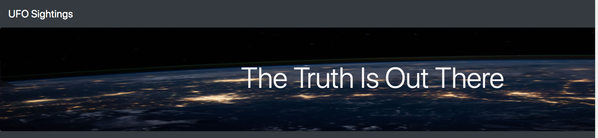
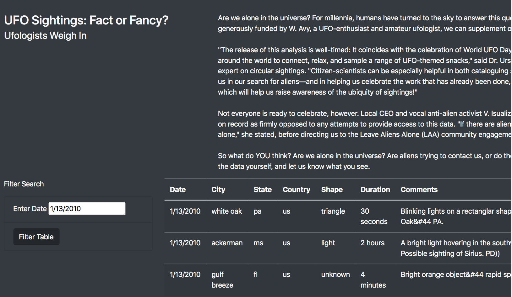
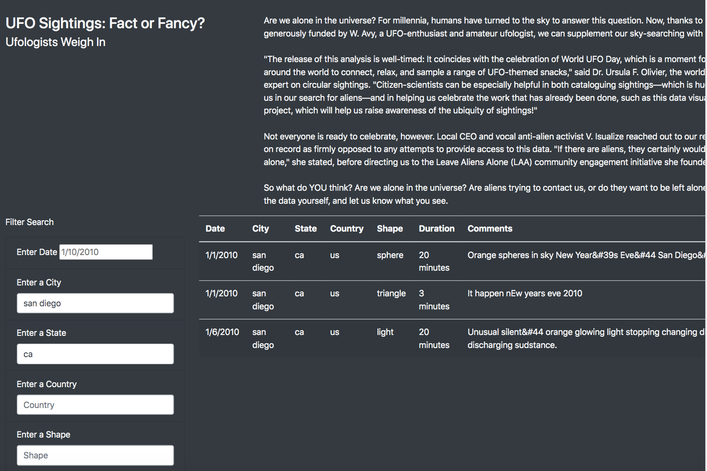

# UFOs Sightings Visualization - JavaScript

## Overview of Project
The purpose of this project is to visualize UFOs sightings based on the data provided (js/data.js) and create dynamic webpages with the following tasks to complete:
* Accept user inputs and adjust accordingly
* Built by inserting JavaScript into HTML page

## Project Description
There is different folder that were used to analyze and filter data:
* UFO_1 folder contains files that only filters by date with Filter Search button
* UFO_2 folder contains files that have multiple filter and filter out the table by typing in the input box

## Sample of Dynamic Webpages
UFO_1:

UFO_2:

## Summary
Based on the new design in UFO_2 sample, there is one drawback. The drawback was the user is asked to type in the input box to filter the data. 

For further development, two recommendations that can be done are we can use a checkbox and dropdown selection to filter the data.

